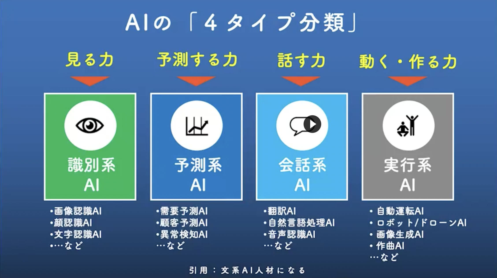

 
      
#本題
今回この記事を書いたキッカケとして、
「経済を、もっとおもしろく。」ビジネスパーソンや就活生必携のソーシャル経済メディアのNewsPicksで放映された、
番組の「未来を創る！新世紀のAI技術」という回でした。

#学びの詳細
  
この写真が分かり易いので参考にさせて頂きました。

これを見てもわかる通り、AI業界の現場仕事では4つに分類されておりAIについて知識がない人でも、身近にある物でも想像できるのではないでしょうか。これから更に発展していくAIの知見を高くすることは大事だと思いますし、どう動くのかどう育成するのかなどを深堀すると、更に学び楽しさが出来るのではないかと思いました。

#参考文献
NewsPicks
番組/OFFRECO/「未来を創る！新世紀のAI技術」
https://newspicks.com/movie-series/44?movieId=1735
